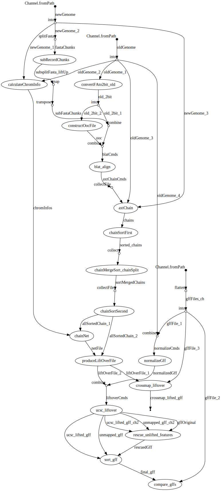

# doSameSpeciesLiftOver_nextflow
A NextFlow pipeline to lift over GFF files using the USCS liftover tools. 

Unlike many other liftOver pipelines, which use pre-computed liftover files, this script generates a custom liftover file by performing blat alignment of the provided FASTA files.

- Inspired by: [doSameSpeciesLiftOver.pl](https://genome-source.gi.ucsc.edu/gitlist/kent.git/raw/master/src/hg/utils/automation/doSameSpeciesLiftOver.pl)
- And this: [using-liftover-to-convert-genome-assembly-coordinates/](https://iamphioxus.org/2013/06/25/using-liftover-to-convert-genome-assembly-coordinates/)
- Also this: [flo](https://github.com/wurmlab/flo)


## Installation

1. Install [Miniconda3](https://conda.io/en/latest/miniconda.html)
2. Setup conda environment 

```
conda create --name doSameSpeciesLiftOver
conda activate doSameSpeciesLiftOver
```
3. Install conda dependencies:  

```
conda config --add channels bioconda
conda config --add channels conda-forge
conda config --set channel_priority false
conda install nextflow graphviz
```
4. The `doSameSpeciesLiftOver.nf` script will dynamically install the rest of the conda dependencies as needed, but the dependicies can be preinstalled if you'd like. Install using the below line and simply delete the conda directives from the `doSameSpeciesLiftOver.nf` script, or set the `totalCondaEnvPath` parameter to an environment with the dependencies.

```
conda install ucsc-fatotwobit blat ucsc-fasplit ucsc-liftup \
ucsc-axtchain ucsc-chainmergesort ucsc-chainsplit ucsc-chainsort \
seqkit ucsc-chainnet ucsc-netchainsubset ucsc-liftover \
genometools-genometools gffutils
```

## Example

```
nextflow run doSameSpeciesLiftOver.nf \
-resume \
--gff examples/Homo_sapiens.GRCh38_chr6-subset.84.gff3 \
--oldFasta examples/hg38-chr6-subseq1.fa \
--newFasta examples/hg38-chr6-subseq2.fa \
-with-trace examples/trace.txt \
-with-report examples/report.html \
-with-dag examples/flowchart.svg
```

## Known issues
- Splitting of FASTA files to a sub-record level (e.g. using non-default values for `params.splitDepth` `params.splitSize` `params.recordSplit` and `params.extraBases`), leads to an incorrect liftover file. I believe the NextFlow logic is correct, so the problem is something I don't understand about blat, chainfiles, and/or liftover files.
- blat isn't multithreaded. Could use [pblat](https://github.com/icebert/pblat) instead.

## Workflow flowchart

